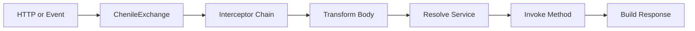
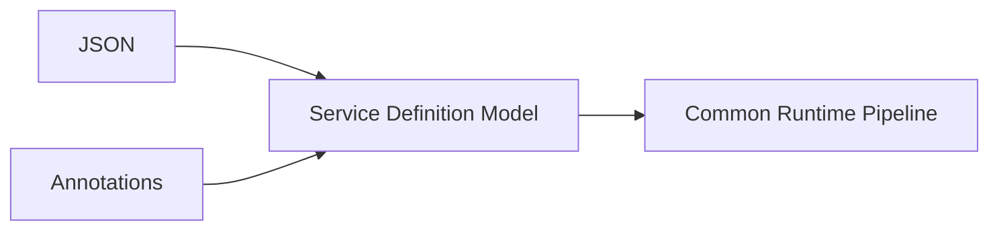
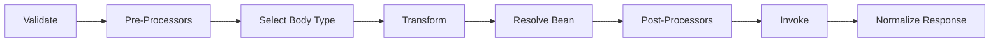
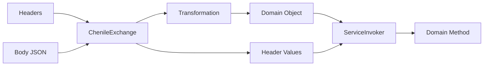
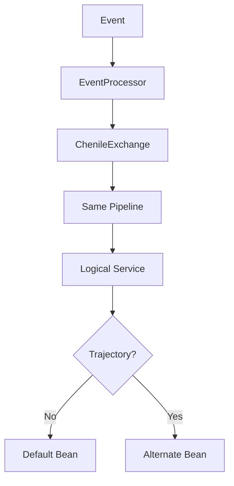
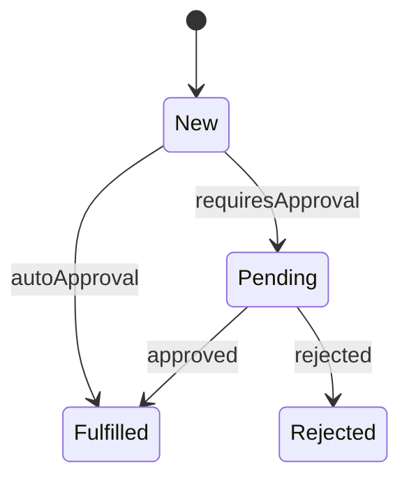
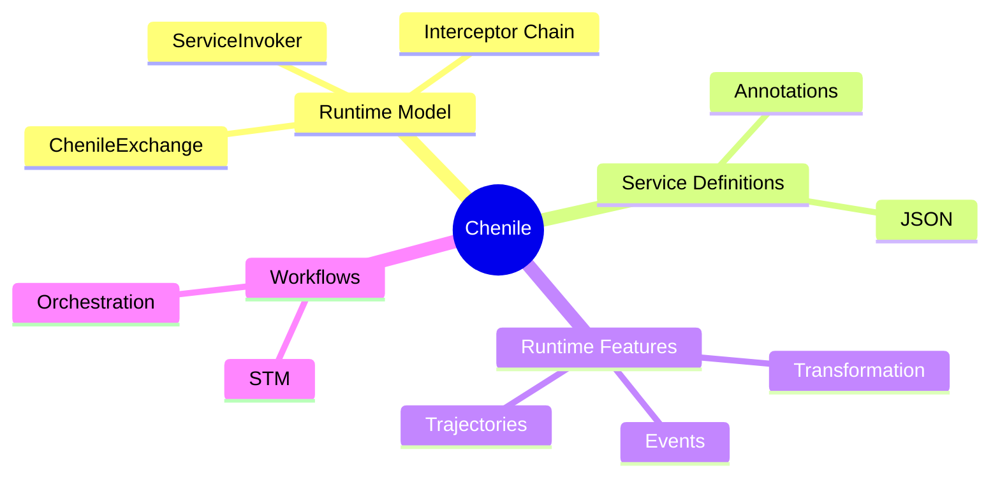
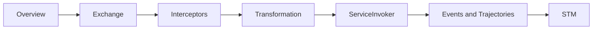

# Chenile Intro Mermaid Diagrams For Presentation

These are presentation-tuned Mermaid diagrams with simpler labels and cleaner shapes for exporting into SVG or PNG.

Use these when the default diagrams feel too text-heavy on slides.

## Export tips

- Use Mermaid Live Editor
- Prefer SVG export for slides
- Increase spacing before export
- If labels wrap awkwardly, shorten them before exporting

## Diagram 1: Core Runtime Pipeline

## Diagram 2: Service Definition Convergence

## Diagram 3: Interceptor Skeleton

## Diagram 4: Domain Binding

## Diagram 5: Events And Trajectories

## Diagram 6: STM Snapshot

## Diagram 7: Chenile Capability Map

## Diagram 8: Learning Path

## Suggested usage

- Slide 4: Diagram 1
- Slide 5: Diagram 2
- Slide 6: Diagram 3
- Slide 7: Diagram 4
- Slide 8: Diagram 5
- Slide 9: Diagram 6
- Optional appendix: Diagram 7 or 8
