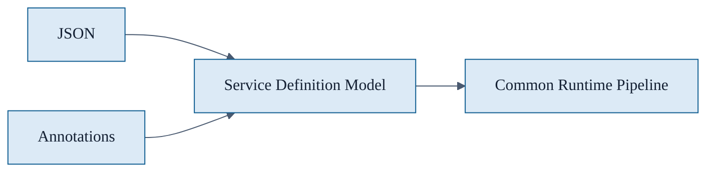
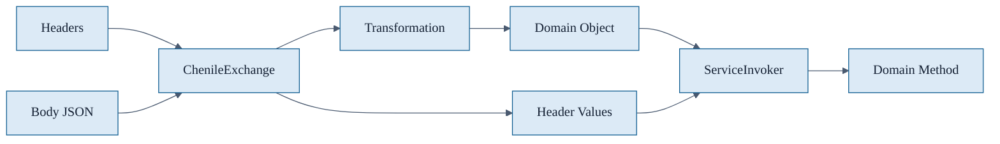
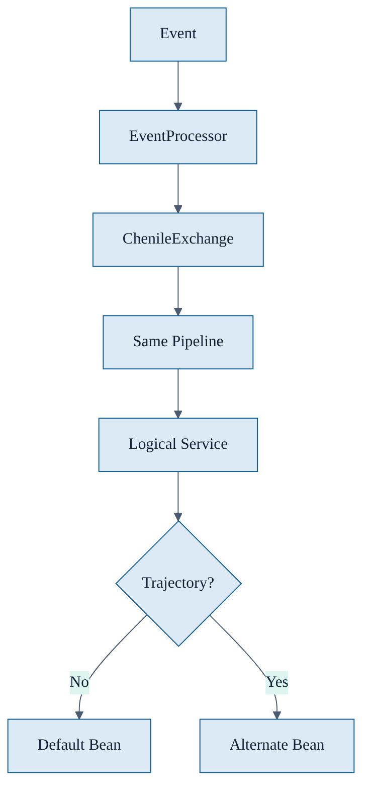
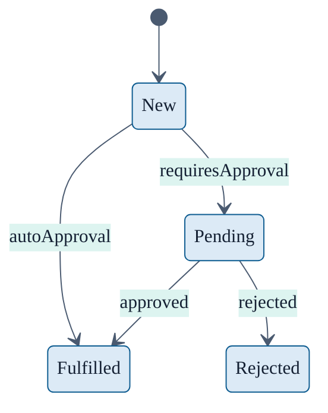

# Chenile Intro Mermaid Diagrams With Theme

These diagrams include Mermaid init blocks for more consistent export.

Use these directly in Mermaid-compatible tools when you want a cleaner light presentation look.

## Common theme

```mermaid
%%{init: {
  "theme": "base",
  "themeVariables": {
    "primaryColor": "#DCEAF6",
    "primaryTextColor": "#142033",
    "primaryBorderColor": "#0F5D91",
    "lineColor": "#4A5A70",
    "secondaryColor": "#DDF4F0",
    "tertiaryColor": "#F7F8FA",
    "fontFamily": "IBM Plex Sans"
  }
}}%%
flowchart LR
    A[HTTP or Event] --> B[ChenileExchange]
    B --> C[Interceptor Chain]
    C --> D[Transform Body]
    D --> E[Resolve Service]
    E --> F[Invoke Method]
    F --> G[Build Response]
```

## Service definition convergence

## Interceptor skeleton

```mermaid
%%{init: {
  "theme": "base",
  "themeVariables": {
    "primaryColor": "#DCEAF6",
    "primaryTextColor": "#142033",
    "primaryBorderColor": "#0F5D91",
    "lineColor": "#4A5A70",
    "secondaryColor": "#DDF4F0",
    "tertiaryColor": "#F7F8FA",
    "fontFamily": "IBM Plex Sans"
  }
}}%%
flowchart LR
    A[Validate] --> B[Pre-Processors]
    B --> C[Select Body Type]
    C --> D[Transform]
    D --> E[Resolve Bean]
    E --> F[Post-Processors]
    F --> G[Invoke]
    G --> H[Normalize Response]
```

## Domain binding

## Events and trajectories

## STM snapshot

