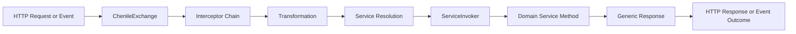
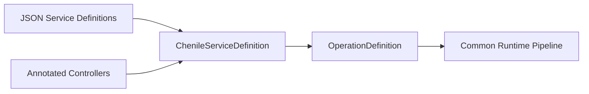
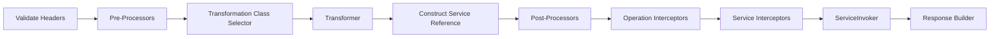
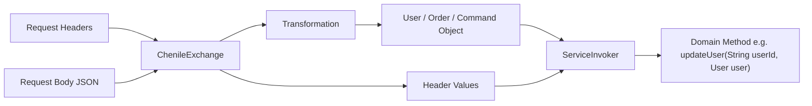
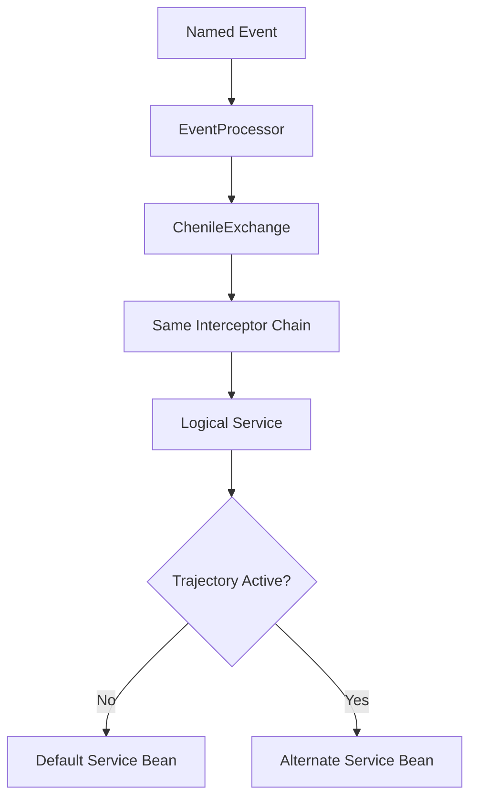
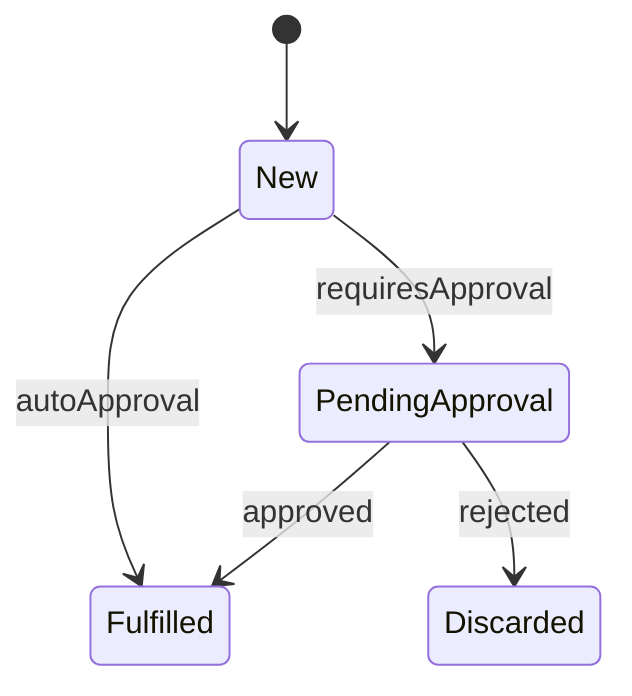
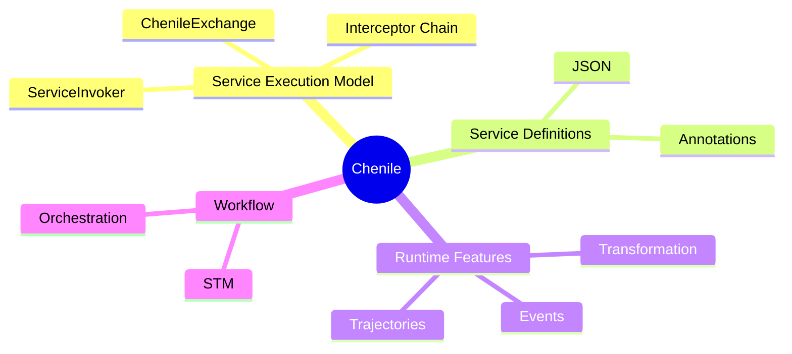
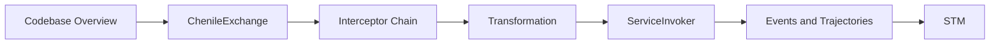

# Chenile Intro Mermaid Diagrams

These Mermaid diagrams are designed for the intro slide deck.

Use them in one of these ways:

- paste into Mermaid Live Editor and export as SVG or PNG
- paste into Markdown tools that support Mermaid
- convert to images and place into Google Slides

## Diagram 1: Core Runtime Model

## Diagram 2: JSON And Annotations Converge

## Diagram 3: Interceptor Chain

## Diagram 4: Domain Binding

## Diagram 5: Events And Trajectories

## Diagram 6: STM Overview

## Diagram 7: Broader Chenile Capability Map

## Diagram 8: Suggested Reading Path

