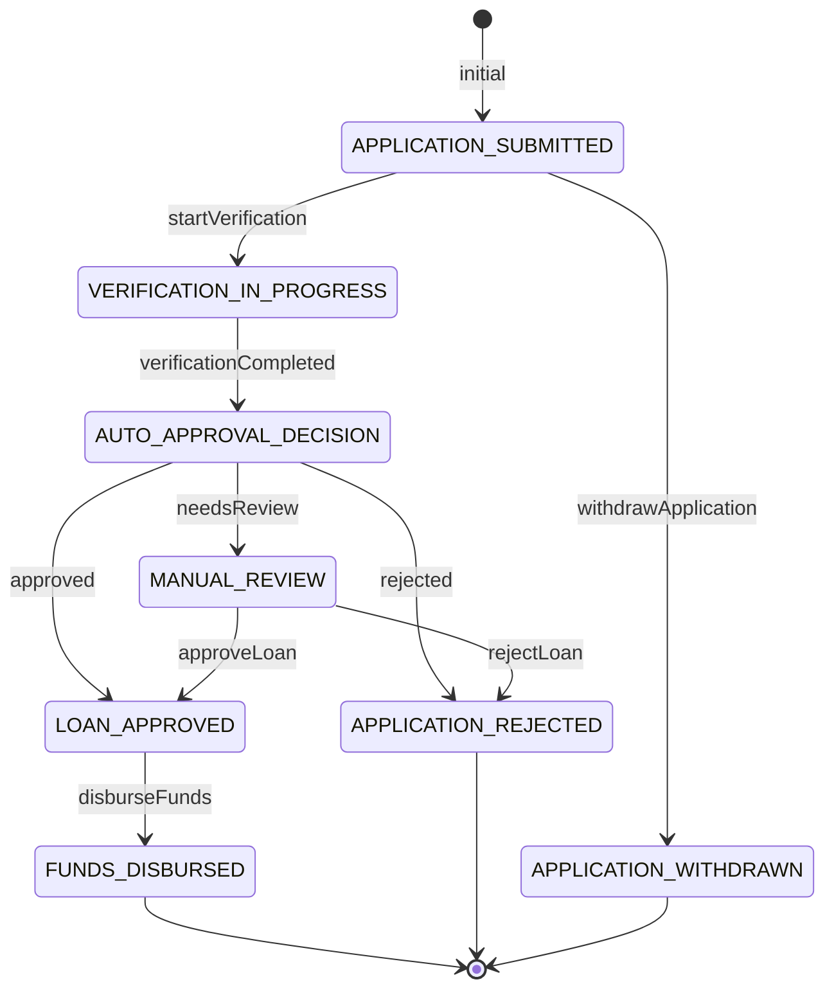
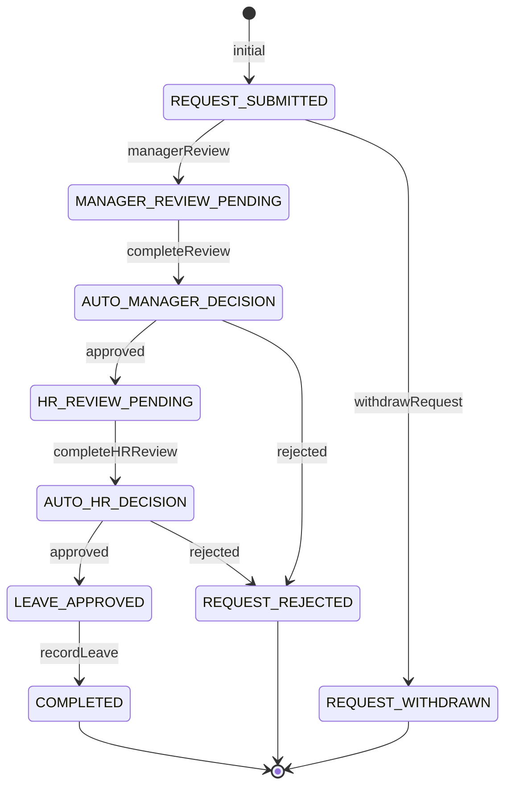
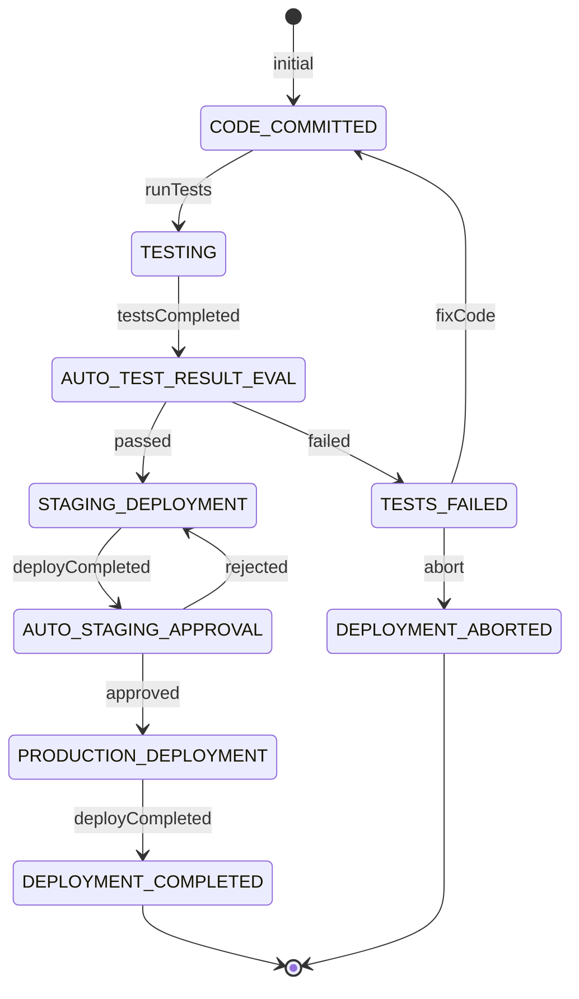

---

# Quick Help Guide: Understanding STM XML

---

## What is STM XML?

**STM (State Transition Machine) XML** is a structured way to define business workflows or processes using states and events. It models how an entity transitions from one state to another based on events or conditions.

---

## Core Concepts

* **Flow:** Represents the entire workflow/process.
* **State:** A stage or condition in the workflow.
* **Event:** An action or occurrence triggering a transition between states.
* **Transition:** Movement from one state to another based on an event.

---

## Main XML Elements and Attributes

### `<states>`

Root container holding one or more `<flow>` elements.

### `<flow>`

Defines a single state machine workflow.

* **Attributes:**

    * `id` — Unique identifier for the flow.
    * `default` — Marks the default/active flow (optional).

---

### State Elements

#### `<manual-state>`

A state that waits for an explicit event (usually from a user or system action) to trigger a transition.

* **Attributes:**

    * `id` — Unique state name.
    * `initialState` (optional) — Marks this as the starting state.

* **Inside:**
  `<on>` elements describing events that cause state changes.

#### `<auto-state>`

A state that automatically transitions to another state based on evaluating a condition or variable (typically from the payload).

* **Attributes:**

    * `id` — Unique state name.
    * `code` — Expression evaluated against state data to decide transition.

* **Inside:**
  `<on>` elements describing possible automatic transitions keyed by event IDs.

---

### `<on>`

Defines a transition triggered by an event.

* **Attributes:**

    * `eventId` — Name of the triggering event.
    * `newStateId` (optional) — The state to transition into after the event.
    * `componentName` (optional) — A handler or processor invoked on the event.
    * `invokableOnlyFromStm` (optional) — Limits invocation context.

---

## How It Works (Simplified)

1. Workflow starts at a state marked `initialState="true"` (usually a `manual-state`).
2. Events (`eventId`) happen — either user/system-triggered or automatically in an `auto-state`.
3. Events cause transitions to other states, possibly invoking components.
4. `auto-state` transitions happen automatically by evaluating conditions on the state’s payload.
5. The process continues until reaching a terminal or closed state.

---

## Example Snippet

```xml
<manual-state id="ORDER_PLACED" initialState="true">
  <on eventId="processPayment" componentName="ProcessPayment" newStateId="PAYMENT_VERIFICATION"/>
  <on eventId="cancel" newStateId="ORDER_CANCELLED"/>
</manual-state>

<auto-state id="PAYMENT_VERIFICATION" code="payload.paymentStatus">
  <on eventId="success" newStateId="ORDER_CONFIRMED"/>
  <on eventId="failure" newStateId="PAYMENT_FAILED"/>
</auto-state>
```

* `ORDER_PLACED` waits for events `processPayment` or `cancel`.
* After `processPayment`, it moves to `PAYMENT_VERIFICATION`.
* `PAYMENT_VERIFICATION` auto-evaluates the payment status and transitions accordingly.

---

## Tips

* Use **manual-states** for user or external input-based transitions.
* Use **auto-states** to model automatic decision points based on business data.
* The `componentName` typically links to code handling event logic.
* Keep state IDs and event IDs descriptive and consistent.

---

## Business Use Case Examples
### E-Commerce Order Processing (Payment Verification)

```xml
<states>
  <flow id="order-processing" default="true">

    <manual-state id="ORDER_PLACED" initialState="true">
      <on eventId="cancel" newStateId="ORDER_CANCELLED"/>
      <on eventId="processPayment" componentName="ProcessPayment" newStateId="PAYMENT_VERIFICATION"/>
    </manual-state>

    <!-- Auto-state verifies payment based on payload result -->
    <auto-state id="PAYMENT_VERIFICATION" code="payload.paymentStatus">
      <on eventId="success" newStateId="ORDER_CONFIRMED"/>
      <on eventId="failure" newStateId="PAYMENT_FAILED"/>
    </auto-state>

    <manual-state id="PAYMENT_FAILED">
      <on eventId="retryPayment" componentName="RetryPayment" newStateId="PAYMENT_VERIFICATION"/>
      <on eventId="cancel" newStateId="ORDER_CANCELLED"/>
    </manual-state>

    <manual-state id="ORDER_CONFIRMED">
      <on eventId="shipOrder" componentName="ShipOrder" newStateId="ORDER_SHIPPED"/>
    </manual-state>

    <manual-state id="ORDER_SHIPPED">
      <on eventId="deliver" newStateId="ORDER_DELIVERED"/>
    </manual-state>

    <manual-state id="ORDER_DELIVERED"/>
    <manual-state id="ORDER_CANCELLED"/>

  </flow>
</states>
```


**Explanation:**

* After `processPayment`, the flow moves to `PAYMENT_VERIFICATION` (an `auto-state`).
* The `code="payload.paymentStatus"` means the transition is decided based on the value of `paymentStatus` in the state entity.
* If `paymentStatus` is `"success"`, it auto-transitions to `ORDER_CONFIRMED`.
* If `"failure"`, it transitions to `PAYMENT_FAILED`.

---

###  Loan Application with Auto-Decision Step

```xml
<states>
  <flow id="loan-application" default="true">

    <manual-state id="APPLICATION_SUBMITTED" initialState="true">
      <on eventId="startVerification" newStateId="VERIFICATION_IN_PROGRESS"/>
      <on eventId="withdrawApplication" newStateId="APPLICATION_WITHDRAWN"/>
    </manual-state>

    <manual-state id="VERIFICATION_IN_PROGRESS">
      <on eventId="verificationCompleted" componentName="CompleteVerification" newStateId="AUTO_APPROVAL_DECISION"/>
    </manual-state>

    <!-- Auto-state for automatic approval decision based on verification results -->
    <auto-state id="AUTO_APPROVAL_DECISION" code="payload.verificationResult">
      <on eventId="approved" newStateId="LOAN_APPROVED"/>
      <on eventId="rejected" newStateId="APPLICATION_REJECTED"/>
      <on eventId="needsReview" newStateId="MANUAL_REVIEW"/>
    </auto-state>

    <manual-state id="MANUAL_REVIEW">
      <on eventId="approveLoan" newStateId="LOAN_APPROVED"/>
      <on eventId="rejectLoan" newStateId="APPLICATION_REJECTED"/>
    </manual-state>

    <manual-state id="LOAN_APPROVED">
      <on eventId="disburseFunds" componentName="DisburseFunds" newStateId="FUNDS_DISBURSED"/>
    </manual-state>

    <manual-state id="FUNDS_DISBURSED"/>
    <manual-state id="APPLICATION_REJECTED"/>
    <manual-state id="APPLICATION_WITHDRAWN"/>

  </flow>
</states>
```

**Explanation:**

* After verification completes, control moves to `AUTO_APPROVAL_DECISION`.
* The auto-state reads `payload.verificationResult`.
* Depending on value (`approved`, `rejected`, `needsReview`), the flow transitions automatically.
* `needsReview` routes to a manual review state.

---




### **Employee Leave Request Workflow**

```xml
<states>
  <flow id="leave-request" default="true">

    <manual-state id="REQUEST_SUBMITTED" initialState="true">
      <on eventId="managerReview" newStateId="MANAGER_REVIEW_PENDING"/>
      <on eventId="withdrawRequest" newStateId="REQUEST_WITHDRAWN"/>
    </manual-state>

    <manual-state id="MANAGER_REVIEW_PENDING">
      <on eventId="completeReview" componentName="CompleteReview" newStateId="AUTO_MANAGER_DECISION"/>
    </manual-state>

    <!-- Auto-state that decides leave approval based on manager decision in payload -->
    <auto-state id="AUTO_MANAGER_DECISION" code="payload.managerDecision">
      <on eventId="approved" newStateId="HR_REVIEW_PENDING"/>
      <on eventId="rejected" newStateId="REQUEST_REJECTED"/>
    </auto-state>

    <manual-state id="HR_REVIEW_PENDING">
      <on eventId="completeHRReview" componentName="CompleteHRReview" newStateId="AUTO_HR_DECISION"/>
    </manual-state>

    <!-- Auto-state that decides final approval based on HR review -->
    <auto-state id="AUTO_HR_DECISION" code="payload.hrDecision">
      <on eventId="approved" newStateId="LEAVE_APPROVED"/>
      <on eventId="rejected" newStateId="REQUEST_REJECTED"/>
    </auto-state>

    <manual-state id="LEAVE_APPROVED">
      <on eventId="recordLeave" componentName="RecordLeave" newStateId="COMPLETED"/>
    </manual-state>

    <manual-state id="COMPLETED"/>
    <manual-state id="REQUEST_REJECTED"/>
    <manual-state id="REQUEST_WITHDRAWN"/>

  </flow>
</states>
```

**Explanation:**

* After manager review completes, auto-state `AUTO_MANAGER_DECISION` checks `payload.managerDecision`.
* After HR review completes, auto-state `AUTO_HR_DECISION` checks `payload.hrDecision`.
* Each auto-state routes flow based on approval/rejection automatically.





---

### **Software Deployment Pipeline**

```xml
<states>
  <flow id="deployment-pipeline" default="true">

    <manual-state id="CODE_COMMITTED" initialState="true">
      <on eventId="runTests" componentName="RunTests" newStateId="TESTING"/>
    </manual-state>

    <manual-state id="TESTING">
      <on eventId="testsCompleted" componentName="AnalyzeTestResults" newStateId="AUTO_TEST_RESULT_EVAL"/>
    </manual-state>

    <!-- Auto-state evaluates test results in payload -->
    <auto-state id="AUTO_TEST_RESULT_EVAL" code="payload.testStatus">
      <on eventId="passed" newStateId="STAGING_DEPLOYMENT"/>
      <on eventId="failed" newStateId="TESTS_FAILED"/>
    </auto-state>

    <manual-state id="TESTS_FAILED">
      <on eventId="fixCode" newStateId="CODE_COMMITTED"/>
      <on eventId="abort" newStateId="DEPLOYMENT_ABORTED"/>
    </manual-state>

    <manual-state id="STAGING_DEPLOYMENT">
      <on eventId="deployCompleted" componentName="DeployToStaging" newStateId="AUTO_STAGING_APPROVAL"/>
    </manual-state>

    <!-- Auto-state for staging approval based on manual/automatic review -->
    <auto-state id="AUTO_STAGING_APPROVAL" code="payload.stagingApproval">
      <on eventId="approved" newStateId="PRODUCTION_DEPLOYMENT"/>
      <on eventId="rejected" newStateId="STAGING_DEPLOYMENT"/>
    </auto-state>

    <manual-state id="PRODUCTION_DEPLOYMENT">
      <on eventId="deployCompleted" componentName="DeployToProduction" newStateId="DEPLOYMENT_COMPLETED"/>
    </manual-state>

    <manual-state id="DEPLOYMENT_COMPLETED"/>
    <manual-state id="DEPLOYMENT_ABORTED"/>

  </flow>
</states>
```

**Explanation:**

* After tests finish, `AUTO_TEST_RESULT_EVAL` auto-routes depending on test results in `payload.testStatus`.
* After staging deploy, `AUTO_STAGING_APPROVAL` checks `payload.stagingApproval` to decide whether to proceed or retry staging deployment.

---



---


